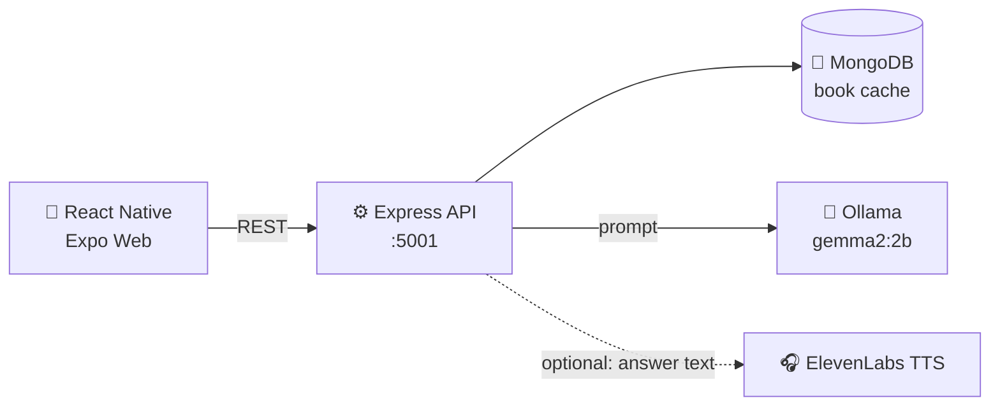

<div align="center">


<br>
<br>

# book.ai

### Read deeper. Spoil nothing. Share nothing.

**A privacy-first, offline-capable AI reading companion that runs on your machine, not in someone else's cloud.**

[](LICENSE)
[](CONTRIBUTING.md)
[](https://hacktoberfest.com)


</div>

---

## 💌 Why book.ai Exists

> _"I just want to ask a question about the chapter I'm on, without the app telling me how the book ends."_

Built for a friend who loves reading, `book.ai` solves three problems with general-purpose chatbots:

- 🔒 **Privacy:** your questions reveal what you think and feel. They stay on your machine.
- 🙈 **Spoilers:** ask about chapter three and get chapter three, not the ending.
- 📴 **Access:** no subscription, and no connection required.

---

## ✨ Key Features

- 🧠 **Local-first AI:** Google's `gemma2:2b` runs through [Ollama](https://ollama.com) on your hardware.
- 📖 **Book exploration:** enter a title for the author, summary, and chapter breakdown.
- 🛡️ **Spoiler-free Read Mode:** chat about a chapter; the AI discusses only what happened up to it.
- 🎧 **Audio narration:** hear answers read aloud via [ElevenLabs](https://elevenlabs.io) text-to-speech.
- 💾 **Smart caching:** overviews are stored in local MongoDB, so repeat visits are instant.
- ✍️ **Clean reading UI:** Markdown-rendered answers in a warm, paper-toned interface.
- 🐳 **One-command infrastructure:** MongoDB and Ollama start together with Docker Compose.

> [!NOTE] > **Privacy and audio:** everything runs locally **except** narration. Tapping the listen button sends that single answer's text to ElevenLabs. Narration is optional; the rest of the app works fully offline.

---

## 🏗️ Architecture & Tech Stack



| Layer              | Technology                     | Role                                            |
| :----------------- | :----------------------------- | :---------------------------------------------- |
| **Frontend**       | React Native (Expo Web)        | Reading interface, chapter cards, chat view     |
| **Backend**        | Node.js + Express (TypeScript) | REST API, prompt building, caching, audio proxy |
| **Database**       | MongoDB (local)                | Caches generated book overviews                 |
| **AI Engine**      | Ollama + Google `gemma2:2b`    | Book overviews and spoiler-free chapter Q&A     |
| **Audio**          | ElevenLabs API                 | Text-to-speech narration of answers             |
| **Infrastructure** | Docker + Docker Compose        | One-command local MongoDB and Ollama            |

### API at a glance

| Method             | Endpoint                 | Body                     | Response                   |
| :----------------- | :----------------------- | :----------------------- | :------------------------- |
| `YOUR_METHOD_HERE` | `YOUR_NEW_ENDPOINT_HERE` | `YOUR_REQUEST_BODY_HERE` | `YOUR_RESPONSE_SHAPE_HERE` |
| `YOUR_METHOD_HERE` | `YOUR_NEW_ENDPOINT_HERE` | `YOUR_REQUEST_BODY_HERE` | `YOUR_RESPONSE_SHAPE_HERE` |

---

## 🚀 Local Setup Guide

Get book.ai running in about ten minutes (most of it is the model download).

### ✅ Prerequisites

| Requirement                                                       | Notes                                               |
| :---------------------------------------------------------------- | :-------------------------------------------------- |
| [**Docker**](https://docs.docker.com/get-docker/) with Compose v2 | Runs MongoDB and Ollama                             |
| [**Node.js**](https://nodejs.org) 18 or newer                     | Needed for the built-in `fetch` used by the backend |
| [**ElevenLabs API key**](https://elevenlabs.io)                   | Free tier works. Only needed for audio narration    |
| **~4 GB free disk space and 8 GB RAM**                            | For the model and containers                        |

### 📥 Clone the repository

```bash
git clone https://github.com/your-username/book.ai.git
cd book.ai
```

### 🔑 Step 1: Set up environment variables

Create a `.env` file inside the `backend` folder:

```bash
cat > backend/.env << 'EOF'
PORT=5001
ELEVENLABS_API_KEY=your_elevenlabs_api_key_here
EOF
```

Then open `backend/.env` and replace `your_elevenlabs_api_key_here` with your real key from the [ElevenLabs dashboard](https://elevenlabs.io/app/settings/api-keys).

> [!WARNING]
> Never commit your `.env` file. Make sure `.env` is listed in `.gitignore`.

### 🐳 Step 2: Start the Docker infrastructure

```bash
docker compose up -d
```

This starts the local MongoDB and Ollama containers. Check that both are running:

```bash
docker ps
```

### 🧠 Step 3: Pull the model

Download Google's Gemma 2 (2B) into the Ollama container. This is a one-time download of about 1.6 GB:

```bash
docker exec -it local_ollama ollama pull gemma2:2b
```

Confirm it is installed:

```bash
docker exec -it local_ollama ollama list
```

### ⚙️ Step 4: Start the backend

```bash
cd backend
npm install
npm run dev
```

You should see the backend start on **http://localhost:5001** and connect to MongoDB.

### 🎨 Step 5: Start the frontend

Open a **new terminal** and run:

```bash
cd frontend
npm install
npm run web
```

Expo will open book.ai in your browser (usually at **http://localhost:8081**). Search for a book, tap a chapter, and start asking questions. 🎉

---

## 🛠️ Troubleshooting

<details>
<summary><b>🐢 Responses are very slow, or Explore times out</b></summary>

<br>

The model is probably running on CPU.

- **macOS:** Docker can't use the Mac GPU. Install the [native Ollama app](https://ollama.com/download), stop the `local_ollama` container, and run `ollama pull gemma2:2b`. The backend reaches `http://127.0.0.1:11434` either way.
- **Linux with NVIDIA:** enable GPU access via the [NVIDIA Container Toolkit](https://docs.nvidia.com/datacenter/cloud-native/container-toolkit/latest/install-guide.html).
- **Diagnose:** `docker exec -it local_ollama ollama ps` shows whether the model is loaded and on which processor.
- **Lighter model:** pull a smaller model and set `OLLAMA_MODEL` in `backend/.env`.

</details>

<details>
<summary><b>🚫 Network or CORS error in the browser</b></summary>

<br>

Confirm the backend is running on port `5001` and CORS is enabled (`app.use(cors())`).

</details>

<details>
<summary><b>🔍 "model not found" error from Ollama</b></summary>

<br>

Run `docker exec -it local_ollama ollama list` and confirm `gemma2:2b` is listed. If not, repeat Step 3.

</details>

<details>
<summary><b>🔇 Audio narration does not play</b></summary>

<br>

Check that `ELEVENLABS_API_KEY` is set in `backend/.env`, restart the backend, and confirm you're online (narration is the only feature that needs internet).

</details>

---

## 🤝 Contributing

PRs are very welcome, especially this October. 🍂

1. 🍴 Fork the repository
2. 🌿 Create a branch: `git checkout -b feature/amazing-idea`
3. 💾 Commit: `git commit -m "Add amazing idea"`
4. 📤 Push: `git push origin feature/amazing-idea`
5. 🔃 Open a Pull Request

Browse [`good first issue`](../../issues?q=is%3Aissue+is%3Aopen+label%3A%22good+first+issue%22) and [`hacktoberfest`](../../issues?q=is%3Aissue+is%3Aopen+label%3Ahacktoberfest) issues to get started.

**Ideas we'd love help with:**

- 🌍 More local models and a model picker
- 📚 Import your own EPUB or PDF for chapter-aware answers
- 🔖 Saved reading progress and conversation history
- 🗣️ A fully offline text-to-speech option
- 📱 Native iOS and Android builds

---

## 🍂 Hacktoberfest 2026 Submission

> **Challenge:** _Build for a Friend_

A real tool for a real person with a real problem.

|     | Technology     | How it is used                                                                                       |
| :-: | :------------- | :--------------------------------------------------------------------------------------------------- |
| 💎  | **Gemma**      | Google's `gemma2:2b` powers book overviews and spoiler-free chapter chat, running locally via Ollama |
| 🎙️  | **ElevenLabs** | Natural text-to-speech narration of the AI's answers                                                 |

---

## 📄 License

Distributed under the **MIT License**. See [`LICENSE`](LICENSE) for details.

---

<div align="center">

**Built with ❤️ for a friend who just wanted to read in peace.**

⭐ If book.ai helps you read better, please consider giving it a star!

</div>
